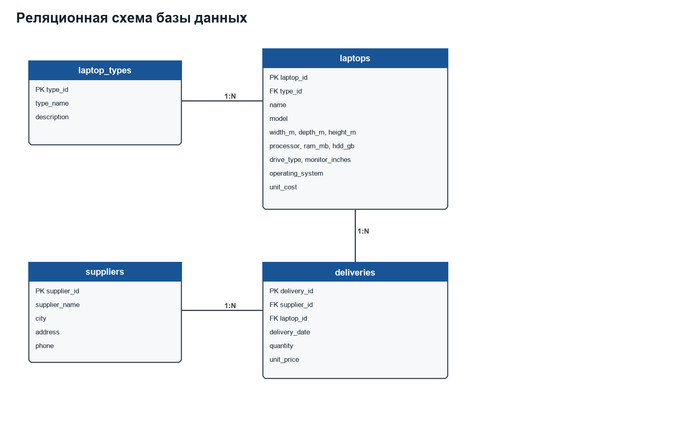
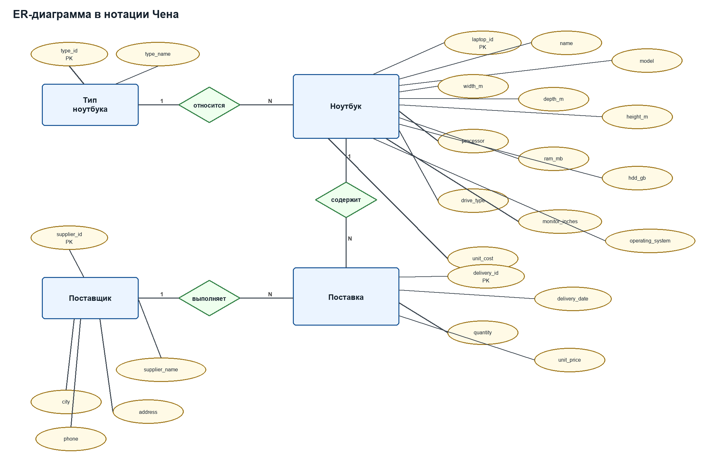

# Курсовая работа по дисциплине «Базы данных»

Тема: база данных и приложение для учета поставок ноутбуков в салон компьютерной техники.

Студентка: Токарева. Вариант: 11.

## Постановка задачи

Салон компьютерной техники получает ноутбуки от нескольких производителей. Необходимо создать базу данных, которая хранит типы ноутбуков, технические характеристики ноутбуков, сведения о поставщиках и данные о поставках. На основе базы требуется выполнить запросы варианта 11 и разработать простое приложение для чтения и записи данных на сервере MySQL.

## Реляционная модель



- laptop_types(type_id PK, type_name, description)
- laptops(laptop_id PK, type_id FK, name, model, width_m, depth_m, height_m, processor, ram_mb, hdd_gb, drive_type, monitor_inches, operating_system, unit_cost)
- suppliers(supplier_id PK, supplier_name, city, address, phone)
- deliveries(delivery_id PK, supplier_id FK, laptop_id FK, delivery_date, quantity, unit_price)

Поле `unit_cost` хранит себестоимость ноутбука. В тексте варианта есть примечание, что прибыль считается как цена продажи минус себестоимость, поэтому себестоимость нужна для корректной экономической интерпретации поставок.

## ER-диаграмма в нотации Чена



## CREATE TABLE

```sql
DROP DATABASE IF EXISTS coursework_db;
CREATE DATABASE coursework_db
    CHARACTER SET utf8mb4
    COLLATE utf8mb4_unicode_ci;

USE coursework_db;

CREATE TABLE laptop_types (
    type_id INT AUTO_INCREMENT PRIMARY KEY,
    type_name VARCHAR(80) NOT NULL UNIQUE,
    description VARCHAR(255) NULL
);

CREATE TABLE laptops (
    laptop_id INT AUTO_INCREMENT PRIMARY KEY,
    type_id INT NOT NULL,
    name VARCHAR(100) NOT NULL,
    model VARCHAR(100) NOT NULL,
    width_m DECIMAL(5,2) NOT NULL,
    depth_m DECIMAL(5,2) NOT NULL,
    height_m DECIMAL(5,2) NOT NULL,
    processor VARCHAR(100) NOT NULL,
    ram_mb INT NOT NULL,
    hdd_gb INT NOT NULL,
    drive_type VARCHAR(60) NOT NULL,
    monitor_inches DECIMAL(4,1) NOT NULL,
    operating_system VARCHAR(80) NOT NULL,
    unit_cost DECIMAL(10,2) NOT NULL,
    CONSTRAINT uq_laptops_name UNIQUE (name),
    CONSTRAINT fk_laptops_type FOREIGN KEY (type_id)
        REFERENCES laptop_types(type_id)
        ON UPDATE CASCADE
        ON DELETE RESTRICT
);

CREATE TABLE suppliers (
    supplier_id INT AUTO_INCREMENT PRIMARY KEY,
    supplier_name VARCHAR(120) NOT NULL UNIQUE,
    city VARCHAR(80) NOT NULL,
    address VARCHAR(255) NOT NULL,
    phone VARCHAR(40) NULL
);

CREATE TABLE deliveries (
    delivery_id INT AUTO_INCREMENT PRIMARY KEY,
    supplier_id INT NOT NULL,
    laptop_id INT NOT NULL,
    delivery_date DATE NOT NULL,
    quantity INT NOT NULL,
    unit_price DECIMAL(10,2) NOT NULL,
    CONSTRAINT fk_deliveries_supplier FOREIGN KEY (supplier_id)
        REFERENCES suppliers(supplier_id)
        ON UPDATE CASCADE
        ON DELETE RESTRICT,
    CONSTRAINT fk_deliveries_laptop FOREIGN KEY (laptop_id)
        REFERENCES laptops(laptop_id)
        ON UPDATE CASCADE
        ON DELETE RESTRICT
);
```

## Тестовые данные

```sql
USE coursework_db;

INSERT INTO laptop_types (type_name, description) VALUES
('Nautilus', 'Флагманская серия ноутбуков'),
('экономическая модель', 'Доступные ноутбуки для офиса и учебы'),
('мини', 'Компактные ноутбуки для поездок'),
('мобильная модель', 'Легкие ноутбуки с длительной автономностью'),
('производительная модель', 'Мощные ноутбуки для сложных задач');

INSERT INTO laptops
(type_id, name, model, width_m, depth_m, height_m, processor, ram_mb, hdd_gb, drive_type, monitor_inches, operating_system, unit_cost)
VALUES
((SELECT type_id FROM laptop_types WHERE type_name = 'Nautilus'), 'Nautilus Pro 15', 'Nautilus-P15', 0.36, 0.25, 0.03, 'Intel-P4 2.8Ггц', 512, 120, 'DVD-CD-RW', 15.0, 'Windows XP', 31000.00),
((SELECT type_id FROM laptop_types WHERE type_name = 'экономическая модель'), 'Rover1000', 'Rover1000', 0.39, 0.28, 0.04, 'Intel-Celeron 2.0Ггц', 256, 80, 'DVD', 14.0, 'Windows XP', 18500.00),
((SELECT type_id FROM laptop_types WHERE type_name = 'мини'), 'MiniBook Air 12', 'MBA-12', 0.28, 0.20, 0.03, 'Intel-P3 1.6Ггц', 256, 60, 'нет', 12.1, 'Windows XP', 20500.00),
((SELECT type_id FROM laptop_types WHERE type_name = 'мобильная модель'), 'TochBook20', 'TochBook20', 0.34, 0.24, 0.03, 'Intel-P4 2,4Ггц', 256, 100, 'DVD-CD-RW', 14.0, 'Windows XP', 27500.00),
((SELECT type_id FROM laptop_types WHERE type_name = 'мобильная модель'), 'TravelMate London', 'TML-14', 0.33, 0.23, 0.03, 'Intel-P4 2,4Ггц', 512, 100, 'DVD-CD-RW', 14.0, 'Windows XP', 28500.00),
((SELECT type_id FROM laptop_types WHERE type_name = 'производительная модель'), 'PowerNote X', 'PN-X', 0.42, 0.31, 0.05, 'Intel-P4 3.2Ггц', 1024, 160, 'DVD-RW', 17.0, 'Windows XP Professional', 39500.00),
((SELECT type_id FROM laptop_types WHERE type_name = 'экономическая модель'), 'OfficeStart 14', 'OS-14', 0.37, 0.26, 0.04, 'Intel-P4 2,4Ггц', 256, 100, 'DVD-CD-RW', 14.0, 'Windows XP', 21000.00),
((SELECT type_id FROM laptop_types WHERE type_name = 'мини'), 'Compact XP', 'CXP-11', 0.27, 0.19, 0.03, 'Intel-Pentium M 1.4Ггц', 256, 40, 'нет', 11.6, 'Windows XP', 19000.00);

INSERT INTO suppliers (supplier_name, city, address, phone) VALUES
('RoverBook', 'Лондон', 'Baker Street, 18', '+44-20-1000-1000'),
('SComp', 'Москва', 'ул. Тверская, 7', '+7-495-111-22-33'),
('TechLine', 'Лондон', 'Oxford Street, 45', '+44-20-2000-2000'),
('CompMarket', 'Нижний Новгород', 'ул. Большая Покровская, 15', '+7-831-222-33-44'),
('NotebookTrade', 'Берлин', 'Alexanderplatz, 3', '+49-30-3333-3333');

INSERT INTO deliveries (supplier_id, laptop_id, delivery_date, quantity, unit_price) VALUES
((SELECT supplier_id FROM suppliers WHERE supplier_name = 'RoverBook'), (SELECT laptop_id FROM laptops WHERE name = 'Rover1000'), '2004-05-03', 15, 24500.00),
((SELECT supplier_id FROM suppliers WHERE supplier_name = 'RoverBook'), (SELECT laptop_id FROM laptops WHERE name = 'TochBook20'), '2004-05-12', 8, 34000.00),
((SELECT supplier_id FROM suppliers WHERE supplier_name = 'SComp'), (SELECT laptop_id FROM laptops WHERE name = 'OfficeStart 14'), '2004-05-18', 20, 26000.00),
((SELECT supplier_id FROM suppliers WHERE supplier_name = 'SComp'), (SELECT laptop_id FROM laptops WHERE name = 'Compact XP'), '2004-04-20', 12, 23500.00),
((SELECT supplier_id FROM suppliers WHERE supplier_name = 'TechLine'), (SELECT laptop_id FROM laptops WHERE name = 'TravelMate London'), '2004-05-25', 10, 36000.00),
((SELECT supplier_id FROM suppliers WHERE supplier_name = 'TechLine'), (SELECT laptop_id FROM laptops WHERE name = 'Nautilus Pro 15'), '2004-06-01', 5, 42000.00),
((SELECT supplier_id FROM suppliers WHERE supplier_name = 'CompMarket'), (SELECT laptop_id FROM laptops WHERE name = 'PowerNote X'), '2004-05-28', 6, 52000.00),
((SELECT supplier_id FROM suppliers WHERE supplier_name = 'CompMarket'), (SELECT laptop_id FROM laptops WHERE name = 'Rover1000'), '2004-03-15', 9, 23800.00),
((SELECT supplier_id FROM suppliers WHERE supplier_name = 'NotebookTrade'), (SELECT laptop_id FROM laptops WHERE name = 'MiniBook Air 12'), '2004-05-08', 7, 25500.00),
((SELECT supplier_id FROM suppliers WHERE supplier_name = 'NotebookTrade'), (SELECT laptop_id FROM laptops WHERE name = 'PowerNote X'), '2004-02-10', 4, 51000.00);
```

## SQL-запросы по варианту

### 1. Ноутбуки, которые поместятся в сумку шириной 0,5 м, глубиной 0,3 м, высотой 0,4 м.

```sql
SELECT name, model, width_m, depth_m, height_m
FROM laptops
WHERE width_m <= 0.50
  AND depth_m <= 0.30
  AND height_m <= 0.40;
```

### 2. Модели по требованиям: Intel-P4 2,4Ггц, ОЗУ 256 Мб, HDD 100 Гб, DVD-CD-RW, 14", Windows XP.

```sql
SELECT name, model, processor, ram_mb, hdd_gb, drive_type, monitor_inches, operating_system
FROM laptops
WHERE processor = 'Intel-P4 2,4Ггц'
  AND ram_mb = 256
  AND hdd_gb = 100
  AND drive_type = 'DVD-CD-RW'
  AND monitor_inches = 14.0
  AND operating_system = 'Windows XP';
```

### 3. Поставщики из Лондона, которые поставляют мобильные модели.

```sql
SELECT DISTINCT s.supplier_name, s.city, s.address
FROM suppliers s
JOIN deliveries d ON d.supplier_id = s.supplier_id
JOIN laptops l ON l.laptop_id = d.laptop_id
JOIN laptop_types lt ON lt.type_id = l.type_id
WHERE s.city = 'Лондон'
  AND lt.type_name = 'мобильная модель';
```

### 4. Общая стоимость каждой поставки.

```sql
SELECT d.delivery_id, s.supplier_name, l.name AS laptop_name, d.delivery_date,
       d.quantity, d.unit_price, d.quantity * d.unit_price AS delivery_total
FROM deliveries d
JOIN suppliers s ON s.supplier_id = d.supplier_id
JOIN laptops l ON l.laptop_id = d.laptop_id
ORDER BY d.delivery_id;
```

### 5. Все ноутбуки, поставляемые поставщиком RoverBook.

```sql
SELECT l.name, l.model, lt.type_name, d.delivery_date, d.quantity, d.unit_price
FROM deliveries d
JOIN suppliers s ON s.supplier_id = d.supplier_id
JOIN laptops l ON l.laptop_id = d.laptop_id
JOIN laptop_types lt ON lt.type_id = l.type_id
WHERE s.supplier_name = 'RoverBook';
```

### 6. Все ноутбуки и их количество, поставляемые поставщиком SComp.

```sql
SELECT l.name, l.model, SUM(d.quantity) AS total_quantity
FROM deliveries d
JOIN suppliers s ON s.supplier_id = d.supplier_id
JOIN laptops l ON l.laptop_id = d.laptop_id
WHERE s.supplier_name = 'SComp'
GROUP BY l.laptop_id, l.name, l.model;
```

### 7. Количество и общая стоимость всех ноутбуков, закупленных в мае 2004 года.

```sql
SELECT SUM(quantity) AS total_quantity,
       SUM(quantity * unit_price) AS total_sum
FROM deliveries
WHERE delivery_date >= '2004-05-01'
  AND delivery_date < '2004-06-01';
```

### 8. Общее количество каждой поставленной марки ноутбука для каждого поставщика.

```sql
SELECT s.supplier_name, l.name AS laptop_name, SUM(d.quantity) AS total_quantity
FROM deliveries d
JOIN suppliers s ON s.supplier_id = d.supplier_id
JOIN laptops l ON l.laptop_id = d.laptop_id
GROUP BY s.supplier_name, l.name
ORDER BY s.supplier_name, l.name;
```

### 9. Поставщики, не поставляющие экономическую модель.

```sql
SELECT s.supplier_name, s.city, s.address
FROM suppliers s
WHERE NOT EXISTS (
    SELECT 1
    FROM deliveries d
    JOIN laptops l ON l.laptop_id = d.laptop_id
    JOIN laptop_types lt ON lt.type_id = l.type_id
    WHERE d.supplier_id = s.supplier_id
      AND lt.type_name = 'экономическая модель'
);
```

### 10. Дата самой дорогой поставки и данные поставщика.

```sql
SELECT d.delivery_id, d.delivery_date, s.supplier_name, s.city, s.address,
       d.quantity * d.unit_price AS delivery_total
FROM deliveries d
JOIN suppliers s ON s.supplier_id = d.supplier_id
WHERE d.quantity * d.unit_price = (
    SELECT MAX(quantity * unit_price)
    FROM deliveries
);
```

### 11. Для каждого поставщика дата самой дешевой поставки.

```sql
SELECT s.supplier_name, d.delivery_id, d.delivery_date,
       d.quantity * d.unit_price AS delivery_total
FROM suppliers s
JOIN deliveries d ON d.supplier_id = s.supplier_id
WHERE d.quantity * d.unit_price = (
    SELECT MIN(d2.quantity * d2.unit_price)
    FROM deliveries d2
    WHERE d2.supplier_id = s.supplier_id
)
ORDER BY s.supplier_name;
```

### 12. Поставщики, которые не поставляют Rover1000 или TochBook20.

```sql
SELECT s.supplier_name, s.city, s.address
FROM suppliers s
WHERE NOT EXISTS (
    SELECT 1
    FROM deliveries d
    JOIN laptops l ON l.laptop_id = d.laptop_id
    WHERE d.supplier_id = s.supplier_id
      AND l.name IN ('Rover1000', 'TochBook20')
);
```

### 13. UPDATE: изменить объем оперативной памяти ноутбука Rover1000.

```sql
UPDATE laptops
SET ram_mb = 512
WHERE name = 'Rover1000';
```

### 14. DELETE: удалить из списка поставщиков фирму SComp.

```sql
DELETE FROM deliveries
WHERE supplier_id = (SELECT supplier_id FROM suppliers WHERE supplier_name = 'SComp');

DELETE FROM suppliers
WHERE supplier_name = 'SComp';
```

## Приложение

Приложение выполнено на C# WinForms с использованием MySqlConnector. Оно подключается к MySQL, показывает таблицы ноутбуков, поставщиков и поставок, выполняет основные SELECT-запросы варианта, добавляет и удаляет записи поставок, выполняет UPDATE для Rover1000 и DELETE для SComp.

## Вывод

В работе спроектирована база данных для учета поставок ноутбуков, построены ER-диаграмма и реляционная модель, подготовлены SQL-скрипты создания и заполнения таблиц, выполнены запросы варианта 11. Разработанное приложение подтверждает возможность чтения и изменения данных на сервере MySQL.
