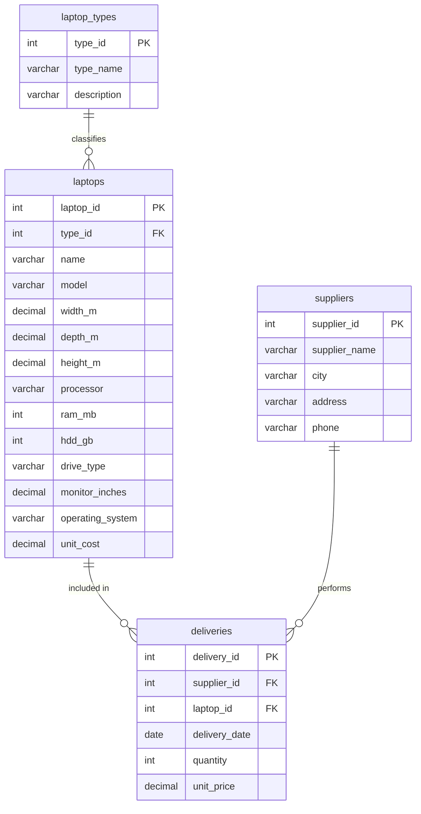

# Схема хранения данных

## ER-модель в нотации Чена

Сущности:

- `Тип ноутбука` - классификация ноутбуков: Nautilus, экономическая модель, мини, мобильная модель, производительная модель.
- `Ноутбук` - модель ноутбука с техническими характеристиками и себестоимостью.
- `Поставщик` - организация, поставляющая ноутбуки.
- `Поставка` - факт поставки конкретного ноутбука конкретным поставщиком в определенную дату.

Связи:

- `Тип ноутбука` 1:N `Ноутбук`: один тип включает несколько ноутбуков, каждый ноутбук относится к одному типу.
- `Поставщик` 1:N `Поставка`: один поставщик может выполнить много поставок.
- `Ноутбук` 1:N `Поставка`: один ноутбук может поставляться в разных партиях.

## Реляционная модель

| Таблица | Первичный ключ | Внешние ключи | Назначение |
| --- | --- | --- | --- |
| `laptop_types` | `type_id` | - | Справочник типов ноутбуков |
| `laptops` | `laptop_id` | `type_id -> laptop_types.type_id` | Ноутбуки и технические характеристики |
| `suppliers` | `supplier_id` | - | Поставщики и их адреса |
| `deliveries` | `delivery_id` | `supplier_id -> suppliers.supplier_id`, `laptop_id -> laptops.laptop_id` | Партии поставок ноутбуков |

## Mermaid-версия схемы

Поле `unit_cost` хранит себестоимость ноутбука. Оно добавлено из-за примечания варианта о расчете прибыли как разницы между ценой продажи и себестоимостью.

